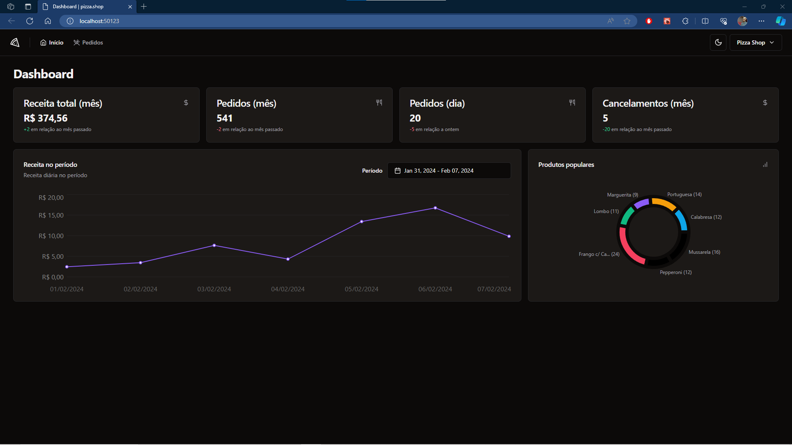
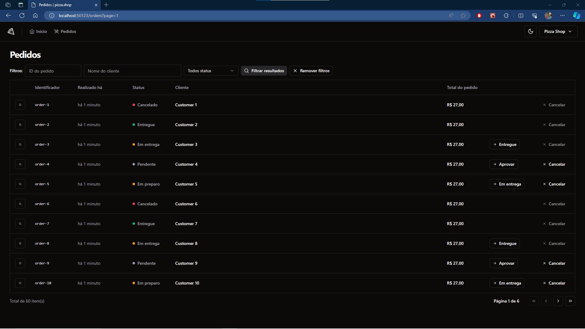
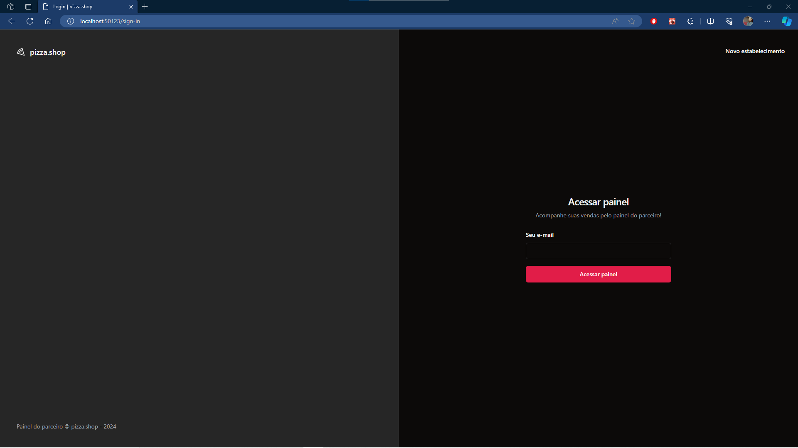
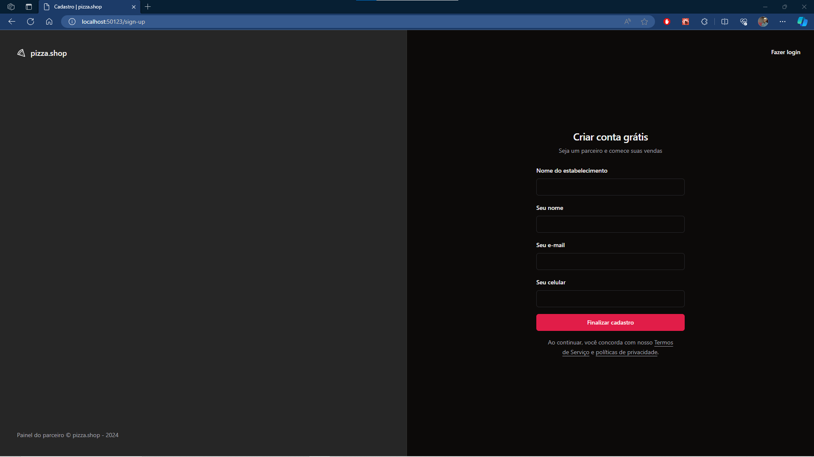
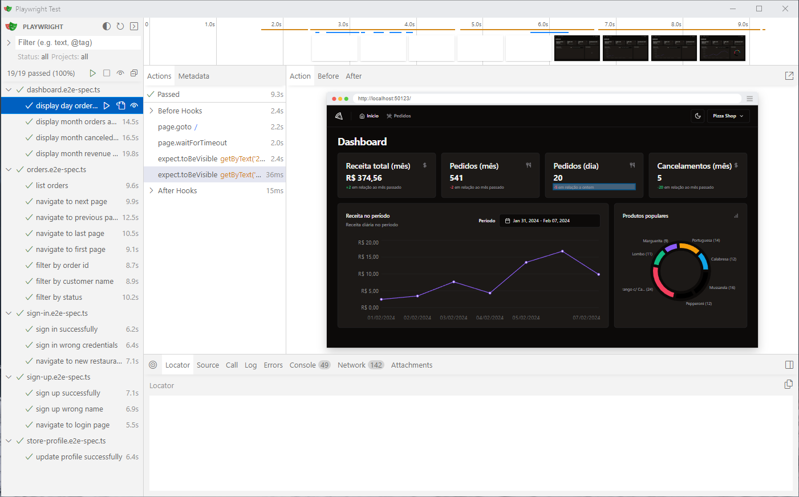

<h1 align="center"> Pizza Shop </h1>

🔨 Tools: Typescript, React.js, Vitest, Tailwind, Shadcn-ui, Axios, Jest-dom, Playwright

#

# Get started

 To use the project, after downloading it you must run install all the dependencies. To do that, run the following command:

```
npm install
```

## Testing

To see the project running, you can run the following command:

```
npm run dev:test
```

After that, you should be able to access the application in the address: 
<br>
[http://localhost:50123/](http://localhost:50123/)

##

To confirm that everything is ok, you can run unit test by using the command: 

```
npm run test
```

Or you can run e2e test by using:

```
npx playwright test
```

You can also add the following flag to open an UI
```
npx playwright test --ui
```

#

# Preview

## Dashboard
<p align="center">
  
</p>

## Orders
<p align="center">
  
</p>

## Sign in
<p align="center">
  
</p>

## Sign up
<p align="center">
  
</p>

## E2E suite tests
<p align="center">
  
</p>
